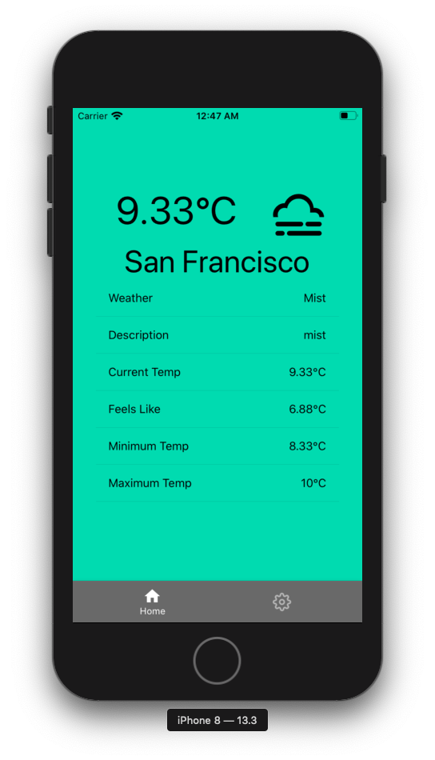

# Weather App
Simple weather app made using react native. It uses a weather API to fetch the current weather (based on your location).

## Things to do before running the app
This app uses Expo, so make sure that it's downloaded. You can download Expo [here](https://expo.io/tools).
You also need your own weather API key which you can get by creating a free account at [Open Weather](https://openweathermap.org/api).

## How to run
1. Make sure you download the dependencies. You can do this by running 
```
yarn install
```

2. Run the command
```
expo start
```

From here, you can view the app from your own phone (using the qr code) or a phone simulator on your phone.

